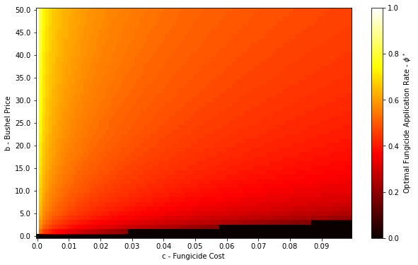
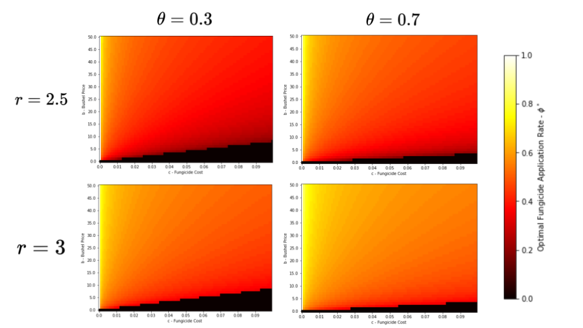
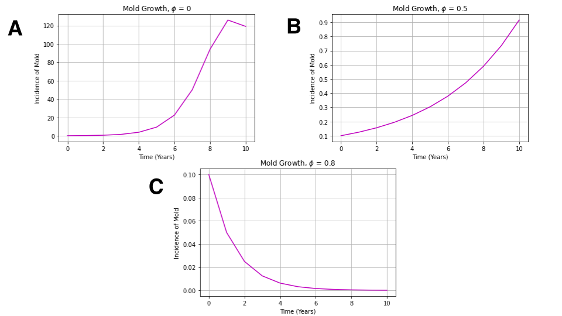
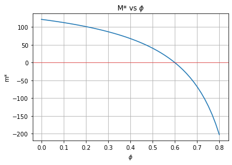
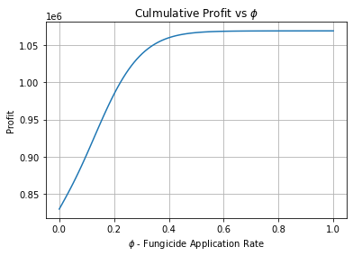
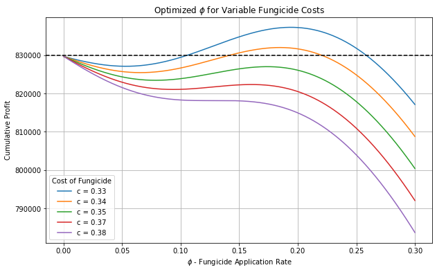

# Multi-dimensional Sensitivity Analysis of Fungicide Application on White Stem Rot Growth and Soybean Production

**Authors:** Tanner Byer (Iowa State University) and Tad Hatfield (Iowa State University)

**Date:** May 12th, 2024

---

## Abstract

*Sclerotinia sclerotiorum* fungus, the causative agent of white stem rot, is a significant yield-limiting disease affecting soybean crops in the temperate climates of North America. Effective disease management practices rely on fungicides to mitigate the growth and spread of the disease. In the present study, we construct a mathematical model for a single soybean operation to simulate mold growth and its requisite effects on the yield of soybean crops to ascertain optimal fungicide application rates. We perform a multi-dimensional sensitivity analysis to understand how the cost of fungicide and soybean bushel price affect the optimal fungicide application rate to maximize soybean profits. We observe that optimal fungicide application rates decrease as the costs of fungicide increase. Interestingly, for high fungicide costs, we see that it is more profitable to apply no fungicide rather than low, ineffectual amounts where mold still reaches near-maximal outbreak levels in a finite period. We also note that the optimal fungicide application rate increases as the price of soybean bushels increases; with the expectation of higher profit gains, more of the budget should be allocated to fungicide applications. Finally, we observe that the optimal fungicide application rates are also expectantly higher with elevated levels of white mold growth, and with higher maximal damage of white mold to soybean plants. Several next steps to improve this model are apparent from this work: incorporating variable mold growth rates modeled off of annual weather patterns, including crop rotation practices, and further exploring the relationships that plant and weed densities have on mold growth and yield.

---

## Introduction

White mold sclerotia, also known as *Sclerotinia sclerotiorum*, is a fungus that affects large crop operations in temperate climates [Peltier et al., 2012](#references). In North America alone, this yield-limiting fungus destroyed at least 10 million bushels of soybean crops every year between 1996-2009; economic estimates of cumulative profit loss surpassed 1 billion for this period [Peltier et al., 2012](#references). The yearly incidence of white mold fluctuates vastly due to annual temperature and rainfall levels, two factors contributing substantially to disease dynamics [Peltier et al., 2012](#references). The effects of white mold on soybean yield consistently place the disease in the top 5 of the 23 most pernicious diseases that affect crop yield in North America during seasons with low average temperatures and high precipitation [Peltier et al., 2012](#references).

### Fungus Life Cycle
White mold sclerotia propagates in the soil and can survive there for as long as 10 years. When conditions are right, the fungus sprouts up to release ascospores from structures known as apothecia. A single sclerotium can produce over 2,000,000 ascospores in 10 days; these ascospores disperse into the canopy of soybean crops and infect the plant's stems [Steadman, 1983](#references). Epidemics typically occur when soybeans start to canopy around flowering [Shah et al., 2019](#references), a direct result of the preferable cool temperatures and moist conditions that arise when canopies form. If epidemics could be predicted, the expense of routine fungicide applications could be optimized to maintain crop integrity and yield.

### Disease Management
In this model, we specifically look at the chemical control of white stem rot with foliar-applied fungicides. Fungicides are effective at mitigating white mold outbreaks but are not 100% effective [Lehner et al., 2017](#references). Previous research has focused on determining the efficacy of various fungicides in reducing the incidence of white mold in different climates [Wutzki et al., 2016](#references). In drier years, when there is less disease pressure, one is less likely to see a return on investment for the fungicide than a wetter, higher disease pressure year [Mueller, 2014](#references). Optimal fungicide application time is another area of research interest in the fight against *Sclerotinia sclerotiorum*, where it has been shown that application of fungicides during the R1 growth stage provides a higher level of control than during the R3 stage of development [Peltier et al., 2012](#references). Oftentimes, farmers apply fungicide multiple times to get the most control. Farmers must consider how long the fungicide residual will last and how long the window is for the soybean flowering stage when deciding how many times to apply a fungicide [Staton, 2023](#references). Better fungicides typically cost more, so there is a trade-off between fungicide effectiveness and cost [Webster, 2022](#references). Besides chemical control, white mold can also be controlled using cultural and biological practices. Some common cultural practices used to control white mold include crop rotation (rotating out of soybeans), tillage, and row spacing [Peltier et al., 2012](#references).

### Previous Work
The scope of white mold research mainly focuses on the most effective mitigation strategies farmers can use to combat white mold propagation and the effect white mold has on soybean yield. Regarding the mold's maximal damage to soybean crops, previous studies have found that a 10% increase in white mold incidence would result in a mean yield reduction of 5% [Lehner et al., 2017](#references). Most mathematical modeling in the area of Integrated Pest Management (IPM) takes the approach of looking at the Economic Threshold Level (ETL) and Economic Injury Level (EIL) [Lala et al., 2022](#references) [Chander et al., 2022](#references) [Singh et al., 2023](#references). Economic Threshold Levels have a limited history of being used in modeling white mold applications since only preventative fungicides are available in white mold management, meaning interventions must be more focused on environmental risk forecasting rather than visible symptoms, often rendering traditional ETL models impractical [McCreary et al., 2016](#references).

### Research Objectives
In this study, we build a discrete model to optimize the fungicide application rate to yield the maximum profit from soybean crops in a finite period, given the variability in the cost of fungicide and the market price for soybean bushels. Furthermore, we perform a sensitivity analysis of the optimized fungicide application parameter for varied levels of the intrinsic growth rate of mold and the maximal degree of mold damage to soybean crops.

---

## Materials and Methods

### Model for Seasonal White Stem Growth
We model the season growth of white stem rot on a closed, 100-acre farm ecosystem using a difference equation model that tracks the average incidence of mold observed per plant during a growing season. The model assumes that each year there is consistent soil moisture and temperature; in effect, we consider only a constant intrinsic growth rate of mold, \(r_m\). Here, our simulations are run when \(r_m = 2.5\) to avoid analyses for highly periodic mold outbreak steady states. In the present study, we also assume a constant 250,000 soybean seeds, \(s\), are planted on each acre of the farm from year to year.

\[
m_{t+1} = (1-\phi)r_mm_t(1-\kappa \frac{m_t}{\beta s})
\]

The model computes the incidence of mold in the next season as a function of the mold surviving from the year prior (\(m_t\)) deterred by a constant fungicide application rate (\(\phi\)). Here, \(\phi\) represents the weekly rate at which fungicide is applied throughout the soybean's reproductive stage. For example, for a \(\phi\) value of 0.5, the fungicide is applied every other week, while a \(\phi\) value of 1 indicates that the fungicide is applied weekly. We assume a constant fungicide efficacy of 100%, meaning that for the fungicide that does come in contact with white mold, the fungicide kills the white mold 100% of the time. Since the canopy of soybean plants provides the requisite conditions for mold proliferation, the carrying capacity of the mold in the closed system is determined by the number of plants on the farm (\(\beta s\)) scaled by a plant-to-mold conversion factor \(\kappa\). Here we assume \(\beta = 0.81\) and \(\kappa = 1000\). For feasibility, we only consider mold growth over 10-year periods.

| Parameter | Description | Units |
|-----------|-------------|-------|
| \(\phi \in [0,1]\) | Fungicide application rate |  1/week |
| \(r_m\) | Intrinsic mold growth rate |  1/year |
| \(\beta\) | Germination rate \(\cdot\) emergence rate | 1/year |
| \(s\) | Seeds planted in a season | seeds |
| \(\kappa\) | Plant to mold scaling factor | dimensionless |

At low fungicide application rates, mold grows logistically to a nontrivial outbreak steady state. In turn, higher rates of fungicide application give way to logistical decay of mold growth. Note that since we consider a constant growth rate of mold, relatively large values for \(\phi\) lead to illogical, negative mold steady states.

\[
m^* = \frac{\beta s}{\kappa} (1- \frac{1}{(1-\phi)r_m})\;|\;\frac{1}{r_m} + \phi \leq 1
\]

We denote the non-trivial mold outbreak steady state in the absence of fungicide as \(m^*_0\). In the context of our model, this is the highest level of mold the farm can experience given a constant mold growth rate and number of seeds planted yearly.

\[
m^*_0 = \frac{\beta s}{\kappa} (1- \frac{1}{r_m})
\]

### Soybean Profit Function
We model the seasonal profit from soybean crops as a function of the total soybean bushels produced (\(\psi \beta s\)) and the average market price of a soybean bushel (\(b\)). The effect of mold on a season's crops is modeled as the incidence of mold normalized by the outbreak steady state of mold in the absence of fungicide, \(m^*_0\). The normalized mold level is then multiplied by the parameter \(\theta,\) describing the maximal damage of mold to soybean crops. Given the diversity of adverse effects mold has on soybeans, and the previous work exploring white stem rot's effect on yield reduction, we estimate this value to be no lower than 0.3. Here \(c\) represents the cost of fungicide application per soybean plant on the farm.

\[
p_t =  b\psi \beta s(1- \theta \frac{m_t}{m^*_0})-c\beta s
\]

We assume that on average, 125,000 plants constitute 50 bushels of soybeans. In the case that fungicide is free, \(c = 0\), we see that the highest cumulative 10-year profits are awarded to farmers with the highest rates of fungicide application.

| Parameter | Description | Units |
|-----------|-------------|-------|
| \(b\) | Soybean bushel price |  dollars |
| \(\psi\) | Plant to bushel conversion |  bushel/plants |
| \(\theta \in [0,1]\) | Maximal damage of mold to plants | dimensionless |
| \(c\) | cost of fungicide application |  dollar/100 plants |

---

## Results

### Sensitivity Analysis
We aim to ascertain an optimal, constant fungicide application rate to yield the highest soybean profit over 10 years. The optimal fungicide application rate denoted \(\phi^*\) is sensitive to multiple model parameters including fungicide cost (\(c\)) and soybean bushel price (\(b\)).

#### Impact of Fungicide Cost on Optimal Fungicide Application

To account for the sudden jump, we plot mold growth over 10 years with variable fungicide application rates, noting the ratio of the incidence of mold observed in year 10 to that of \(m^*_0,\) the maximum non-trivial mold outbreak steady state.

We observe that for all values of \(\phi \geq 0.50,\) the incidence of mold in year 10 is proportionally non-existent in comparison to \(m^*_0;\) this would account for the steep descent of \(\phi^*\) as the cost of fungicide initially grows from 0. We also see that for \(\phi < 0.2,\) the proportion of mold in year 10 is nearly as severe as in the case where no fungicide is applied. From this, we conclude that for certain fungicide costs, it is more profitable to spend no money on fungicide rather than allocating funds to apply an ineffective amount of fungicide that still allows mold to grow to near-maximal outbreak levels.

#### Soybean Bushel Price

Fig. 4 is a 2-dimensional analysis of the effects fungicide cost and bushel prices play on the optimal fungicide application, \(\phi^*,\) from over 6,250,000 model simulations. Based on our previous 1-dimensional analyses, we note that the partial derivative of  \(\phi^*\) with respect to fungicide cost is negative. Conversely, the partial derivative of  \(\phi^*\) with respect to bushel price is positive. Again, note that the highest values of \(\phi^*\) are localized around the lowest costs for fungicide and the highest prices for soybean bushels. The characteristic black edge at \(\phi^* = 0\) is representative of the adverse economic decision to apply an ineffectual amount of fungicide as the price of fungicide increases.

### 4-Dimensional Sensitivity Analysis

To further investigate the sensitivity of the optimal fungicide rate \(\phi^*,\) we ran 6,250,000 model simulations with variable fungicide cost and bushel prices, this time also varying the intrinsic growth rate of mold (\(r_m\)) and the maximal damage of mold to plants (\(\theta\)). We observe that as the severity of mold's impact and growth rate increase, the optimal fungicide application rate increases as expected. When we consider environments with less impact of mold on plants (\(\theta = 0.3\)), the ineffectual region of fungicide application rates swells for all fungicide costs.

---

## Discussion

In this study, we build a logistical model for mold growth and a soybean profit function to discern the optimal fungicide application rates to maximize cumulative soybean profit over a finite period of 10 years. We analyzed the sensitivity of our optimized fungicide application rate parameter to variability in fungicide application costs and soybean bushel prices. Regarding increasing fungicide costs close to 0, the optimized fungicide rate decreases rapidly to more conservative rates (\(\phi = 0.5\)) that maintain near negligible amounts of mold over 10 years. Interestingly, for high levels of fungicide cost close to 0.3, optimized fungicide rates discontinuously jump to 0, suggesting that applying an ineffectual amount of fungicide, where mold still reaches the maximum mold outbreak levels, is less profitable than applying no fungicide. We also see that rising soybean bushel prices lead to higher optimized fungicide application rates; our result suggests that when expected soybean profit is higher, more money should be allocated to fungicide applications.

We also analyze the effects of variable mold growth levels and maximal mold damage to crops on the optimized fungicide application rates. Intuitively, we see that in conditions when mold grows quicker and has a higher potential for damage to crops, optimal fungicide application rates increase. We also observe that the range of ineffectual fungicide application rates increases for conditions where mold growth rates and maximal mold damage to plants are low.

Recent advancements in data gathering, especially with remote sensing technologies, have enhanced our understanding of white mold levels and their impacts on crops [White Mold Data, 2019](#references). Such data are crucial for refining predictive models. For instance, Sporecaster, a collaborative effort led by the University of Wisconsin, leverages statistical modeling within a mobile app to assess in-season risks of white mold [Chilvers et al., 2018](#references). By improving mathematical models, including ours, we aim to contribute to the development of more precise tools for the agricultural community.

The main limitation of our model is that it fails to account for many different parameters that are important to modeling mold levels over time. We do not account for variables including crop rotation, different crop varieties, weed coverage, field topography, and the influx of white mold spores from other fields. Further, we use a constant growth rate of mold, which we know varies with annual weather conditions. Given the novelty of modeling mold growth, we also lack a robust amount of data to accurately predict certain parameter values including the intrinsic growth rate, scaling factor of mold to plants, and the maximal damage of mold to plants. Our study is also limited by the inherent simplification of modeling mold in a discrete time-space. Given the complexity of the mold life cycle, we have greatly simplified the number of factors that contribute to the growth of mold at its various stages.

Building upon this model, we would like to create a function for the intrinsic growth rate of mold from year to year that varies with annual weather patterns. We would also like to explore varying amounts of seeds planted in a season that reflect the different levels of canopy formed in a growing season and their effect on mold growth. In the same vein, exploring a density-dependent relationship between the number of plants and the total crop yield that reflects the limitations of nutrients in the soil is another area of interest. From this exploration, we would be interested in optimizing both fungicide application rates and the number of seeds planted in a season to achieve maximum profit. Yet another potential expansion of our model is to consider building a continuous time model to better reflect the complexities of the mold life-cycle and the cyclical nature of its prevalence throughout the year.

---

## References

1. Peltier et al., 2012. Biology and epidemiology of white mold (Sclerotinia sclerotiorum) in North America.
2. Steadman, 1983. White mold diseases of bean: epidemiology and management.
3. Shah et al., 2019. Identification of plant species susceptible to white mold (Sclerotinia sclerotiorum) in the soybean cropping system.
4. Lehner et al., 2017. Meta-analysis of fungicide efficacy in controlling white mold in soybeans.
5. Wutzki et al., 2016. Reduction in white mold in soybean crops using different fungicides.
6. Mueller, 2014. Managing white mold in soybeans.
7. Staton, 2023. Fungicide application timing and its impact on white mold control.
8. Webster, 2022. Modern fungicides and their effectiveness.
9. McCreary et al., 2016. Economic Threshold Levels in white mold management.
10. Lala et al., 2022. Importance of Economic Threshold Level in pest management.
11. Chander et al., 2022. Integrated Pest Management and its principles.
12. Singh et al., 2023. Estimation of Economic Injury Levels for white mold.
13. White Mold Data, 2019. Remote sensing technologies for white mold monitoring.
14. Chilvers et al., 2018. Sporecaster: A mobile app for predicting white mold risks.

---

## Supplemental Data

